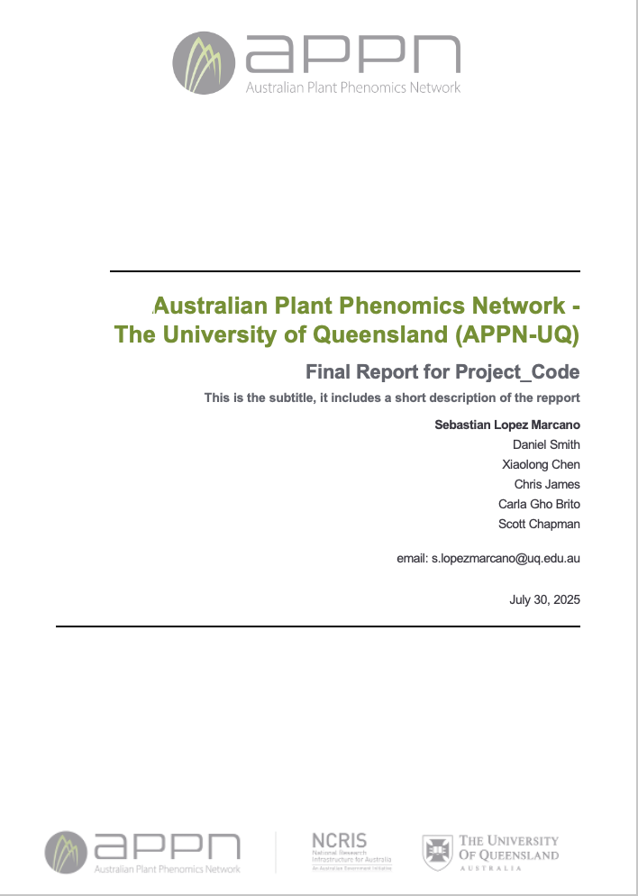
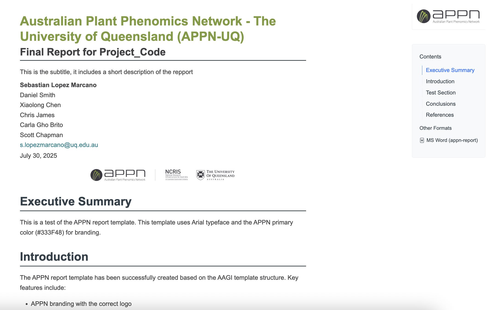

# How to Use APPN Quarto Document Template
This document provides a guide on how to use the APPN Quarto document template for generating reports and documents in your APPN UQ projects.

## Available Templates
### 1. Standard Project Template
The main project structure template with:
- Automatic status badges
- Project tree structure
- APPN branding and acknowledgments

### 2. Quarto Document Template
A Quarto template for generating reports and documents with:

- Custom styles for DOCX, and HTML outputs
- APPN branding

The metadata and formatting are all located in the `_extensions/appn-report` directory. Do not edit the files in here unless you want to change the template's behavior or appearance.

To use the Quarto template, please follow these steps:

- How to install Quarto: [Quarto Installation Guide](https://quarto.org/docs/get-started/)
- Edit the `Template.qmd` file.
- Fill with your content and use code chunks for R or Python code.
- Render the document using Quarto to generate the two supported formats: DOCX and HTML.

    - To save output to a specific directory, use the `--output-dir` flag:
    ```bash
    quarto render Template.qmd --to appn-report-html --output-dir "outputs"
    quarto render Template.qmd --to appn-report-docx --output-dir "outputs"
    ```
    
    - Or specify the exact output file path with `-o`:
    ```bash
    quarto render test_appn_report.qmd --to appn-report-html -o "outputs/my-report.html"
    ```

### Examples of the rendered documents

#### DOCX Output
The DOCX format provides a professional document layout suitable for reports and publications:



**File location**: [`docs/docx/Template.docx`](docs/docx/Template.docx)

#### HTML Output
The HTML format provides an interactive web-based document:



**File location**: [`docs/html/Template.html`](docs/html/Template.html)

